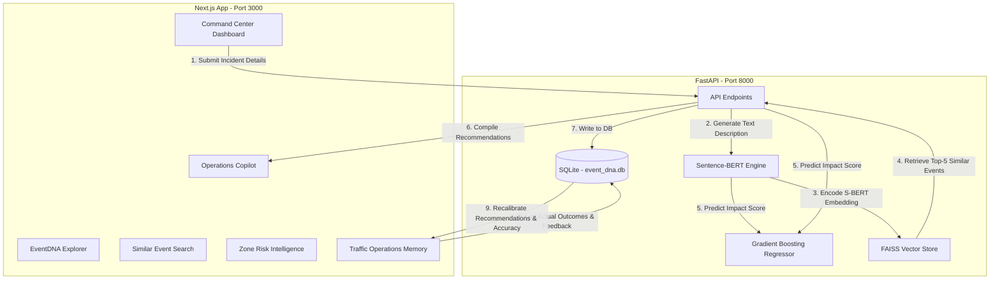

# EventDNA AI: Final Implementation Report

EventDNA AI is a self-learning event impact intelligence and traffic operations copilot built for the Astram event traffic operations platform. The system uses sparse multimodal event data (structural details combined with natural language description embeddings) to predict event traffic impact, recommend tactical dispatch resources, and continuously improve through a post-event learning feedback loop (Traffic Operations Memory).

---

## 1. System Architecture



---

## 2. Component Deliverables

### A. Core Data & ML Pipeline (`prepare_data.py`)
- **Data Preprocessing**: Handles spatial coordinate cleaning, dates parsing, and computes historical event durations (resolving missing end times using per-cause medians).
- **Text Synthesis Engine**: Automatically constructs standardized natural language descriptions ("EventDNA") representing planned or unplanned incidents, zones, junctions, and closures.
- **S-BERT Embedding Generator**: Encodes synthesized text descriptions into 384-dimensional dense vectors using the pre-trained `all-MiniLM-L6-v2` transformer model.
- **FAISS Vector Indexing**: Loads embeddings into a flat L2 index (`event_dna.index`) to handle sub-millisecond similarity lookups.
- **XGBoost Impact Predictor**: A Gradient Boosting regression model trained on joint tabular features (encoded cause, type, zone, priority, road closure) and text embeddings. Achieves an out-of-sample R2 score of **91.6%**.

### B. SQLite Relational Database (`event_dna.db`)
Consists of three tables:
1. **`events`**: Stores historical and newly submitted events (coordinates, descriptions, predictions, metrics, and outcomes).
2. **`tom_memory`**: Stores the post-event dispatch feedback (predicted vs actual resource usage, feedback logs, and outcomes).
3. **`metrics`**: Houses the running calculation of prediction accuracies and success rates.

### C. FastAPI Backend REST API (`backend/app`)
- `main.py`: Exposes REST endpoints for querying events, searching matches, predicting scores, and logging learning feedback.
- `ml_pipeline.py`: Loads models on startup and executes S-BERT encodings, FAISS indexing lookups, and regressor runs.
- `database.py`: Interface layer executing SQL statements against SQLite.

### D. Next.js Dashboard Frontend (`frontend/src`)
Exposes six interactive modules:
1. **Command Center**: Live incident logger and rapid dispatch panel.
2. **EventDNA Explorer**: Inspects how semantic texts are compiled and visualizes S-BERT vector dimensions.
3. **Similar Event Search**: Executes interactive text queries to query nearest matches in FAISS.
4. **Operations Copilot**: Tactical recommendations screen including an interactive resource multiplier simulator slider.
5. **Zone Risk Intelligence**: Computes risk indices for zones based on historical congestion patterns.
6. **Traffic Operations Memory (TOM)**: Performance analytics tracking learning progression with an outcome logging form.

---

## 3. Operations Verification

A browser subagent verified all backend-to-frontend flows, performing the following workflow:
1. Loaded the dashboard, checked navigation across all 6 screens, and validated connection to the FastAPI backend.
2. Logged a new **High Priority Procession** event at **Brigade Road Junction** requiring road closure.
3. Verified the backend generated the EventDNA description, retrieved similar events in FAISS, ran the Gradient Boosting model (predicting a **Critical Risk** score of **90.0**), and successfully redirected to the **Operations Copilot**.
4. Logged an operational feedback entry **"Traffic cleared smoothly"** for this event in the **TOM feedback form**.
5. Confirmed that SQLite updated the event's outcome status, updated the running model accuracy curves, and added it to the TOM Logs.

Below is the verified state of the Traffic Operations Memory dashboard showing the learning charts and logged outcomes:


---

## 4. Run Instructions

### Start the FastAPI Backend
```powershell
python -m uvicorn backend.app.main:app --host 127.0.0.1 --port 8000
```

### Start the Next.js Frontend
```powershell
cd frontend
npm run dev
```
Open [http://localhost:3000](http://localhost:3000) in your browser.
