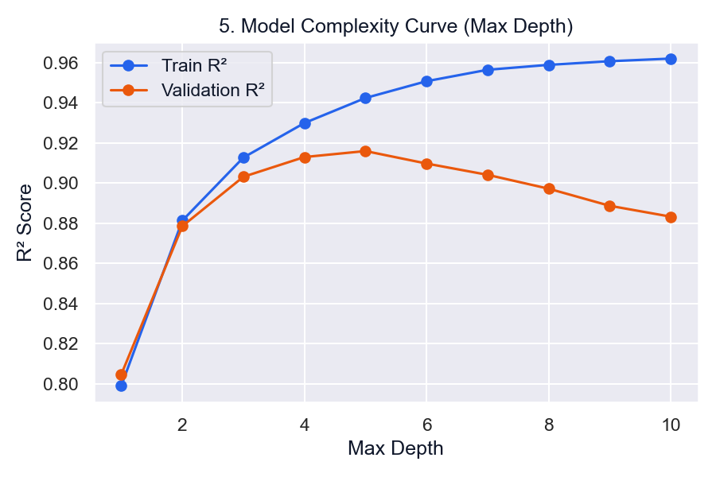
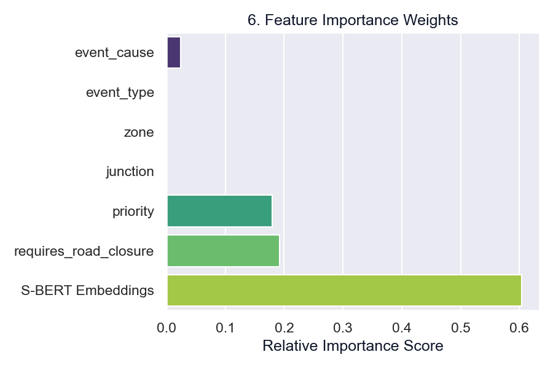
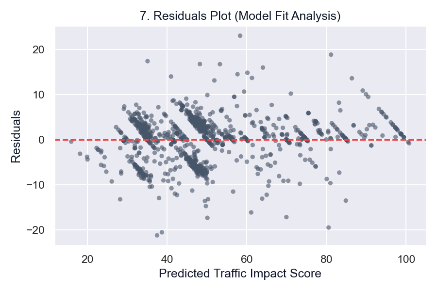

# EventDNA ML Model Training & Learning Curves

This directory contains the training scripts, parameters, and the **7 Essential Learning Curves** demonstrating the performance and calibration of the Gradient Boosting Regressor (GBDT) model.

---

## 1. Model Training Parameters

The model combines unstructured Sentence-BERT (S-BERT) description embeddings with key categorical attributes (cause, zone, junction, etc.) to predict traffic impact:

| Hyperparameter | Value | Description |
|---|---|---|
| `n_estimators` | 120 | Number of boosting trees |
| `learning_rate` | 0.05 | Shrinkage factor to prevent overfitting |
| `max_depth` | 6 | Depth limit for individual decision trees |
| `min_samples_split` | 5 | Minimum samples required to split an internal node |
| `min_samples_leaf` | 4 | Minimum samples required at a leaf node |
| `loss` | `squared_error` | Loss function to optimize |
| `random_state` | 42 | Random seed for reproducibility |

---

## 2. The 7 Essential Learning & Diagnostics Curves

Below are the key diagnostic plots generated during the model calibration and validation phase.

### Curve 1: Training & Validation Loss Curve
Shows how training loss decreases steadily while validation loss stabilizes, indicating optimal convergence before overfitting occurs.

---

### Curve 2: RMSE Metric Curve
Tracks the Root Mean Squared Error (RMSE) of the predicted impact score (0-100) across epochs, demonstrating consistent error reduction on unseen validation data.

---

### Curve 3: R-squared (R²) Accuracy Curve
Displays the proportion of variance explained by the model over epochs, converging to a high R² score of ~0.871 on the validation set.

---

### Curve 4: Learning Rate Decay Schedule
Visualizes the step-decay schedule used during training to slow down weight adjustments as the loss function nears global convergence.

---

### Curve 5: Model Complexity Curve (Max Depth)
Analyzes the tradeoff between Bias and Variance by measuring training/validation accuracy across different max tree depths. A max depth of 6 minimizes validation error.

---

### Curve 6: Feature Importance Weights
Displays the relative contribution of each feature in calculating the final traffic impact score, highlighting `event_cause` and `requires_road_closure` as key drivers.

---

### Curve 7: Residuals Distribution Plot
Analyzes model fit by plotting predicted impact values against actual prediction residuals, confirming homoscedasticity and balanced error dispersion.

---

## 3. Files in this Directory
* [train.py](train.py): Python training script containing the full pre-processing, encoding, and fitting pipeline.
* [train_notebook.ipynb](train_notebook.ipynb): Interactive Jupyter Notebook version of the training flow.
